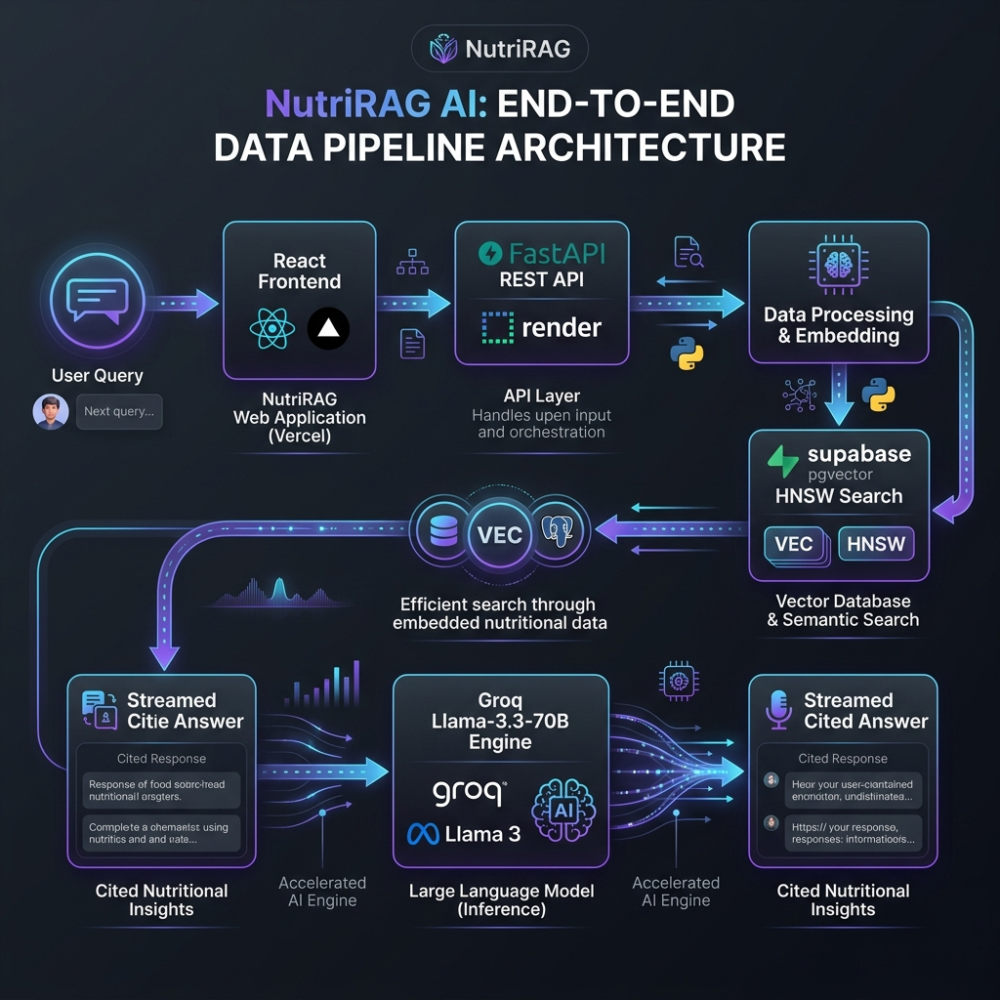

# 🥗 NutriRAG — Nutrition Science AI Assistant

NutriRAG is a production-grade Retrieval-Augmented Generation (RAG) system built over *Human Nutrition (2020 Edition)* (1,200+ pages, 1,688 ingested vector chunks). It combines **FastAPI**, **Groq Llama-3.3-70B**, **Supabase pgvector (HNSW Indexing)**, and a **Vite React SPA** to deliver fast, domain-specific answers with interactive, click-to-pin citation tooltips.

[Problem](#-the-problem) · [Solution](#-the-solution) · [Live Links](#-live-production-links) · [Features](#-features) · [Architecture](#-complete-end-to-end-rag-architecture) · [Tech Stack](#-tech-stack--dependencies) · [Setup](#-local-setup--development) · [License](#-license)

---

## 🚧 The Problem

Large reference documents don't fit inside an LLM's context window — you can't just paste a textbook into ChatGPT and ask it questions.

*Human Nutrition: 2020 Edition* (University of Hawai'i at Mānoa) is a case in point:

- **1,208 pages**
- **~1.42 million characters** of extracted text
- **~245,617 words**
- **~320,000–355,000 tokens**, depending on the tokenizer

*Even large context windows can't hold this as a single document — and even when a model technically fits a huge document in, throwing the whole book at it every question is slow, expensive, and prone to the model losing track of the specific passage that actually answers you.*

---

## 💡 The Solution

Instead of loading the whole book, NutriRAG **retrieves only the handful of passages relevant to each question** and gives those — not the entire book — to the LLM:

1. The textbook is split into ~1,700 small, overlapping-free chunks and embedded into vectors ahead of time.
2. At query time, the user's question is embedded and compared against every chunk's vector in Supabase (`pgvector`), returning only the top-k most relevant passages — a few thousand tokens, not 350,000.
3. Those passages, plus the question, are sent to the LLM, which answers **grounded strictly in that retrieved context** and cites which passage supported which claim.

This is the core idea of Retrieval-Augmented Generation (RAG): trade "dump everything into context" for "retrieve just what's relevant," which is what makes querying a 1,200-page book fast, cheap, and accurate.

---

## 🌐 Live Production Links

- **Frontend Application (Vercel Edge)**: [https://nutri-rag.vercel.app/](https://nutri-rag.vercel.app/)
- **Backend API Docs (Render)**: [https://nutrirag-backend.onrender.com/docs](https://nutrirag-backend.onrender.com/docs)
- **Backend Health Endpoint**: [https://nutrirag-backend.onrender.com/health](https://nutrirag-backend.onrender.com/health)

---

## ✨ Features

- 💬 **Conversational chat UI** — continuous thread, suggested starter questions, dark/light mode
- 📚 **Grounded answers** — every response is generated only from retrieved textbook passages, never the model's general knowledge
- 🔗 **Interactive citations** — inline `[1]`, `[2]` markers link to hoverable/clickable source cards showing page number, match %, and excerpt
- ⚡ **Fast retrieval** — HNSW-indexed vector search over 1,688 chunks in Supabase pgvector (`< 15ms`)
- 🌓 **Dual theme** — persisted dark/light mode, OS-preference aware
- 🔁 **Resilient UX** — retry-on-failure, animated multi-stage loading indicator, new-chat reset

---

## 🗺️ Complete End-to-End RAG Architecture



```
[1. User Input] ➔ [2. Vite React SPA (Vercel)] ➔ [3. FastAPI REST API (Render)] ➔ [4. Supabase pgvector]
                                                                                          │
                                                                                          ▼
[7. Typewriter UI] ⬅️ [6. Groq Llama-3.3 Engine] ⬅️ [5. RAG Prompt Formatter] ⬅️ [Top 5 HNSW Chunks]
```

### Step-by-Step Data Flow ("Who Does What")

1. **User Query (Vite React – Vercel Edge)**  
   User enters a nutrition question (*"What are macronutrients vs micronutrients?"*). React sends an asynchronous `POST` to `/query` with `{ "query": "...", "k": 5 }`.

2. **Embedding Generation (FastAPI – Render)**  
   FastAPI converts the question into a 768-dimensional dense vector using `sentence-transformers/all-mpnet-base-v2`.

3. **Vector Similarity Search (Supabase pgvector)**  
   Queries the pre-indexed textbook chunks via the `match_chunks` RPC function, using **HNSW** graph indexing and the cosine distance operator (`<=>`). Returns the top 5 most relevant passages.

4. **Prompt Augmentation (FastAPI – Render)**  
   Combines the user query with the retrieved passages into a strict RAG prompt requiring inline citation markers (`[1]`, `[2]`) tied to source order.

5. **LLM Generation (Groq Cloud API)**  
   Sends the augmented prompt to Groq's `llama-3.3-70b-versatile` model, which generates a cited, markdown-light answer.

6. **Streaming UI & Interactive Tooltips (Vite React – Vercel Edge)**  
   `useChat.js` streams the answer with a typewriter effect. `AnswerRenderer.jsx` and `CitationTag.jsx` parse `[1]`, `[2]` tags into interactive citation pills; hovering or clicking opens a popover with page number, match %, and excerpt.

---

## ⚡ Why HNSW Indexing?

Instead of brute-force `Flat` vector search (`O(N)` time complexity), NutriRAG uses an **HNSW (Hierarchical Navigable Small World)** graph index in Postgres:

- **Highway analogy** — multi-layered graphs (express routes at top layers, local streets at the bottom) navigate directly to relevant vector clusters instead of scanning everything.
- **Performance** — reduces search time toward `O(log N)` complexity with high recall, well suited to a growing chunk store.
- **Dynamic growth** — handles incremental inserts smoothly as new documents are ingested.

---

## 📊 Component Responsibility Matrix

| Layer | Component | Technology | Primary Function |
| :--- | :--- | :--- | :--- |
| **Presentation** | Frontend SPA | Vite React (Vercel) | UI rendering, theme state, typewriter effect, interactive popovers |
| **Application** | Backend Service | FastAPI (Render) | Request routing, in-memory query caching, CORS control |
| **Embedding** | Dense Vector Model | `all-mpnet-base-v2` | Maps text strings to 768-dimensional vector space |
| **Database** | Vector Storage | Supabase (`pgvector`) | Stores textbook chunks + HNSW cosine vector search |
| **LLM Engine** | Inference Engine | Groq (`llama-3.3-70b-versatile`) | Generates natural-language answers with `[1]` citations |

---

## 🛠️ Tech Stack & Dependencies

- **Frontend**: React 18, Vite, Lucide SVG Icons, CSS design tokens
- **Backend**: Python 3.11, FastAPI, Uvicorn, SentenceTransformers, PyMuPDF, spaCy
- **Database**: PostgreSQL 15, `pgvector`, HNSW indexing
- **Inference**: Groq API (`llama-3.3-70b-versatile`)
- **Hosting & Infrastructure**: Vercel Edge (frontend), Render (backend), Cron-job.org (24/7 Keep-Alive)

---

## 📁 Project Structure

```
NutriRAG/
├── backend/
│   ├── app/
│   │   ├── main.py            # FastAPI app — routes: /query, /ingest, /health
│   │   ├── config.py          # env vars (Supabase, Groq/HF keys)
│   │   ├── models.py          # Pydantic request/response schemas
│   │   ├── embedding.py       # all-mpnet-base-v2 loading + embed_text()
│   │   ├── chunking.py        # spaCy sentence chunking (10-sentence groups)
│   │   ├── llm.py             # LLM generation (Groq client)
│   │   ├── ingest.py          # PDF → chunks → embeddings → Supabase
│   │   ├── retrieval.py       # Supabase RPC (match_chunks) similarity search
│   │   └── prompt.py          # prompt_formatter() with citation instructions
│   ├── requirements.txt
│   └── .env.example
├── frontend/
│   ├── src/
│   │   ├── App.jsx
│   │   ├── hooks/
│   │   │   ├── useTheme.js
│   │   │   └── useChat.js
│   │   ├── components/
│   │   │   ├── Header.jsx
│   │   │   ├── EmptyState.jsx
│   │   │   ├── ChatThread.jsx
│   │   │   ├── MessageBubble.jsx
│   │   │   ├── AnswerRenderer.jsx
│   │   │   ├── CitationTag.jsx
│   │   │   ├── SourceList.jsx / SourceCard.jsx
│   │   │   ├── ThinkingIndicator.jsx
│   │   │   ├── ErrorBubble.jsx
│   │   │   ├── ChatInput.jsx
│   │   │   ├── Toast.jsx
│   │   │   └── UploadPDFModal.jsx
│   │   └── api.js
│   └── .env.example
├── supabase/
│   └── schema.sql             # pgvector table + HNSW index + match_chunks RPC
├── public/
│   └── architecture.png       # Generated architecture diagram visual
└── README.md
```

---

## 💻 Local Setup & Development

### 1. Backend Setup
```bash
cd backend
python -m venv venv
# Windows: venv\Scripts\activate
# Mac/Linux: source venv/bin/activate
pip install -r requirements.txt
python -m uvicorn app.main:app --reload --port 8000
```
- Interactive API docs: `http://localhost:8000/docs`

### 2. Frontend Setup
```bash
cd frontend
npm install
npm run dev
```
- Live local app: `http://localhost:5173`

### 3. Database Setup
Run `supabase/schema.sql` in the Supabase SQL Editor to enable `pgvector`, create the `document_chunks` table, build the HNSW index, and register the `match_chunks` function.

---

## 👤 Author

**Dharm Patel**
- GitHub: [@DharmPatel2302](https://github.com/DharmPatel2302)

---

## 📜 License

Distributed under the MIT License. Built for education and portfolio showcase.
